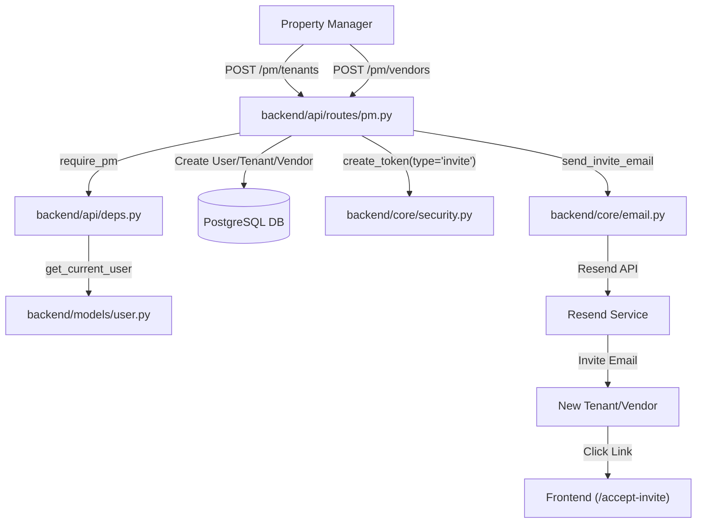

## Architecture: Authentication Phase 2

```mermaid
graph TD
    PM["Property Manager"] -->|"POST /pm/tenants"| PMRouter["backend/api/routes/pm.py"]
    PM -->|"POST /pm/vendors"| PMRouter
    
    PMRouter -->|"require_pm"| Deps["backend/api/deps.py"]
    Deps -->|"get_current_user"| UserMDL["backend/models/user.py"]
    
    PMRouter -->|"Create User/Tenant/Vendor"| DB[("PostgreSQL DB")]
    PMRouter -->|"create_token(type='invite')"| Security["backend/core/security.py"]
    PMRouter -->|"send_invite_email"| EmailSvc["backend/core/email.py"]
    
    EmailSvc -->|"Resend API"| Resend["Resend Service"]
    Resend -->|"Invite Email"| NewUser["New Tenant/Vendor"]
    
    NewUser -->|"Click Link"| Frontend["Frontend (/accept-invite)"]
```
