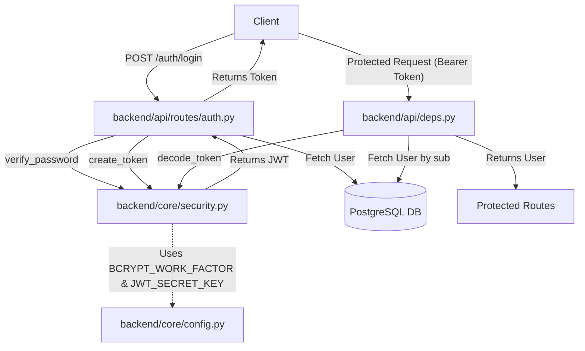

## Architecture: Authentication Phase 1

```mermaid
graph TD
    Client["Client"] -->|"POST /auth/login"| AuthEndpoint["backend/api/routes/auth.py"]
    AuthEndpoint -->|"verify_password"| SecurityInfo["backend/core/security.py"]
    AuthEndpoint -->|"Fetch User"| DB[("PostgreSQL DB")]
    AuthEndpoint -->|"create_token"| SecurityInfo
    SecurityInfo -->|"Returns JWT"| AuthEndpoint
    AuthEndpoint -->|"Returns Token"| Client
    
    Client -->|"Protected Request (Bearer Token)"| Middleware["backend/api/deps.py"]
    Middleware -->|"decode_token"| SecurityInfo
    Middleware -->|"Fetch User by sub"| DB
    Middleware -->|"Returns User"| ProtectedRoute["Protected Routes"]
    
    SecurityInfo -.->|"Uses BCRYPT_WORK_FACTOR & JWT_SECRET_KEY"| Config["backend/core/config.py"]
```
