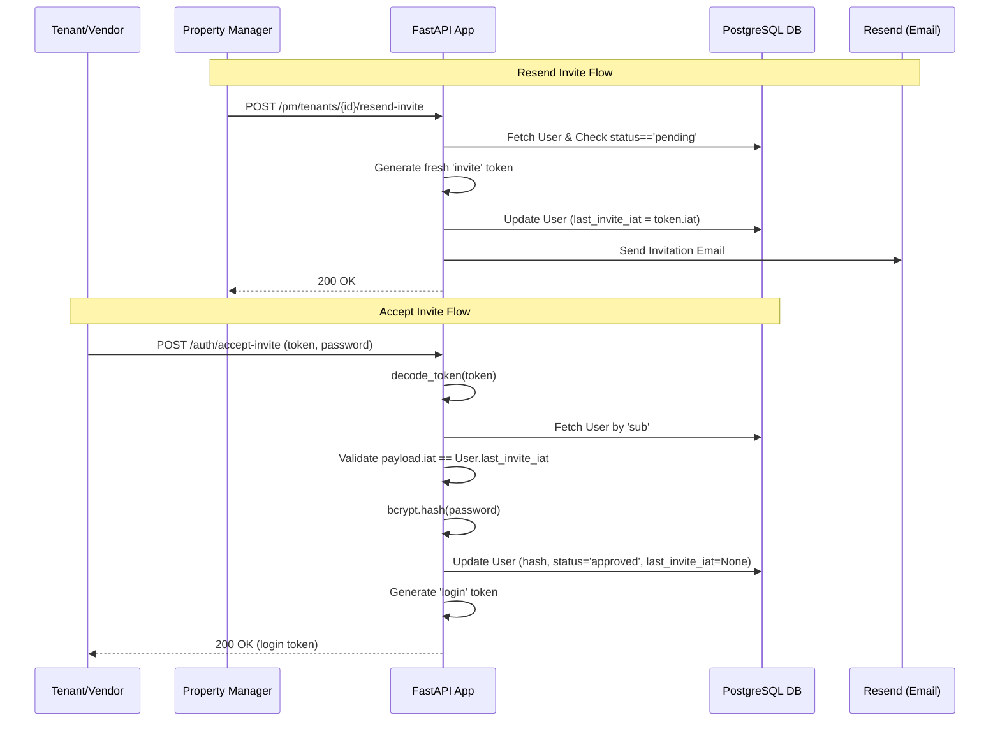

## Architecture: Authentication Phase 3

```mermaid
sequenceDiagram
    participant User as Tenant/Vendor
    participant PM as Property Manager
    participant App as FastAPI App
    participant DB as PostgreSQL DB
    participant Resend as Resend (Email)

    Note over PM, Resend: Resend Invite Flow
    PM->>App: POST /pm/tenants/{id}/resend-invite
    App->>DB: Fetch User & Check status=='pending'
    App->>App: Generate fresh 'invite' token
    App->>DB: Update User (last_invite_iat = token.iat)
    App->>Resend: Send Invitation Email
    App-->>PM: 200 OK

    Note over User, DB: Accept Invite Flow
    User->>App: POST /auth/accept-invite (token, password)
    App->>App: decode_token(token)
    App->>DB: Fetch User by 'sub'
    App->>App: Validate payload.iat == User.last_invite_iat
    App->>App: bcrypt.hash(password)
    App->>DB: Update User (hash, status='approved', last_invite_iat=None)
    App->>App: Generate 'login' token
    App-->>User: 200 OK (login token)
```
