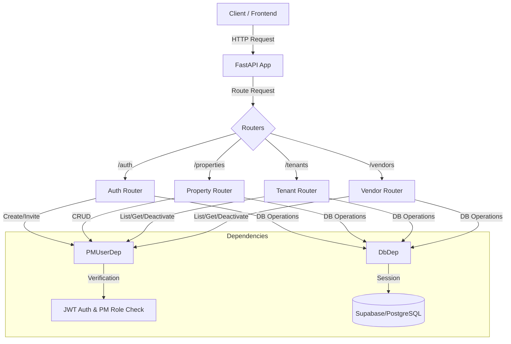

## Architecture: PM Dashboard CRUD APIs

```mermaid
graph TD
    Client[Client / Frontend] -- HTTP Request --> API[FastAPI App]
    API -- Route Request --> Routers{Routers}
    
    Routers -- /auth --> AuthRouter[Auth Router]
    Routers -- /properties --> PropRouter[Property Router]
    Routers -- /tenants --> TenantRouter[Tenant Router]
    Routers -- /vendors --> VendorRouter[Vendor Router]
    
    subgraph Dependencies
        PMDep[PMUserDep] -- Verification --> AuthMiddleware[JWT Auth & PM Role Check]
        DbDep[DbDep] -- Session --> Database[(Supabase/PostgreSQL)]
    end
    
    AuthRouter -- Create/Invite --> PMDep
    AuthRouter -- DB Operations --> DbDep
    
    PropRouter -- CRUD --> PMDep
    PropRouter -- DB Operations --> DbDep
    
    TenantRouter -- List/Get/Deactivate --> PMDep
    TenantRouter -- DB Operations --> DbDep
    
    VendorRouter -- List/Get/Deactivate --> PMDep
    VendorRouter -- DB Operations --> DbDep
```
