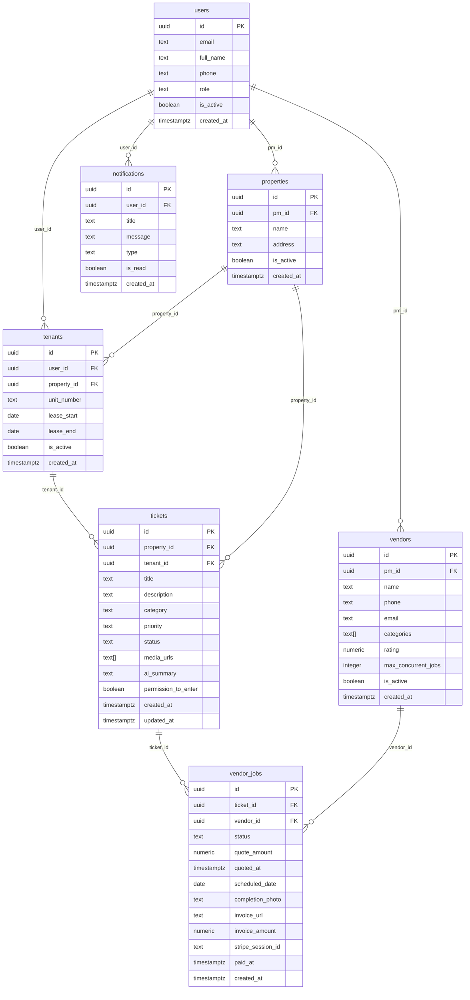

## Architecture: Supabase Database Schema

```mermaid
erDiagram
    users ||--o{ properties : "pm_id"
    users ||--o{ vendors : "pm_id"
    users ||--o{ tenants : "user_id"
    users ||--o{ notifications : "user_id"
    
    properties ||--o{ tenants : "property_id"
    
    tenants ||--o{ tickets : "tenant_id"
    properties ||--o{ tickets : "property_id"
    
    tickets ||--o{ vendor_jobs : "ticket_id"
    vendors ||--o{ vendor_jobs : "vendor_id"

    users {
        uuid id PK
        text email
        text full_name
        text phone
        text role
        boolean is_active
        timestamptz created_at
    }

    properties {
        uuid id PK
        uuid pm_id FK
        text name
        text address
        boolean is_active
        timestamptz created_at
    }

    tenants {
        uuid id PK
        uuid user_id FK
        uuid property_id FK
        text unit_number
        date lease_start
        date lease_end
        boolean is_active
        timestamptz created_at
    }

    vendors {
        uuid id PK
        uuid pm_id FK
        text name
        text phone
        text email
        text[] categories
        numeric rating
        integer max_concurrent_jobs
        boolean is_active
        timestamptz created_at
    }

    tickets {
        uuid id PK
        uuid property_id FK
        uuid tenant_id FK
        text title
        text description
        text category
        text priority
        text status
        text[] media_urls
        text ai_summary
        boolean permission_to_enter
        timestamptz created_at
        timestamptz updated_at
    }

    vendor_jobs {
        uuid id PK
        uuid ticket_id FK
        uuid vendor_id FK
        text status
        numeric quote_amount
        timestamptz quoted_at
        date scheduled_date
        text completion_photo
        text invoice_url
        numeric invoice_amount
        text stripe_session_id
        timestamptz paid_at
        timestamptz created_at
    }

    notifications {
        uuid id PK
        uuid user_id FK
        text title
        text message
        text type
        boolean is_read
        timestamptz created_at
    }
```
