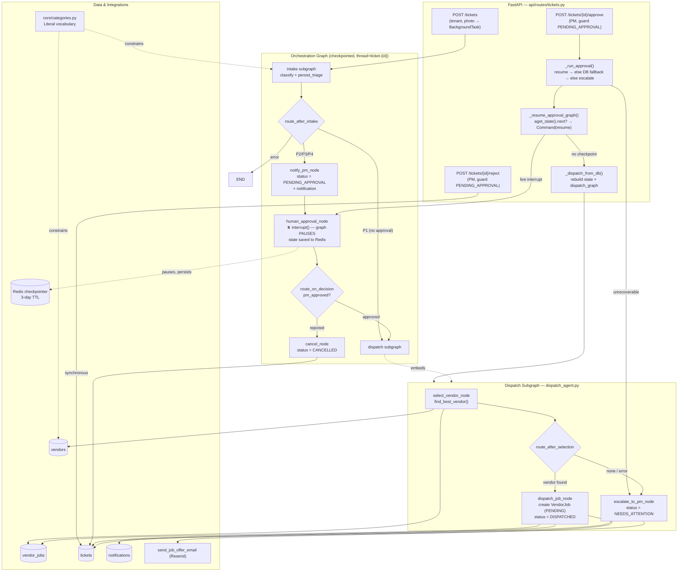

## Architecture: Dispatch Agent (HITL Approval)

### Key relationships
- **HITL pause/resume:** for non-P1 tickets the graph pauses at `human_approval_node`'s
  `interrupt()`, persisting to the Redis checkpointer (`ticket-{id}`, 3-day TTL). `/approve`
  resumes the same thread with `Command(resume=...)`; the frozen state (incl. `category`) is
  preserved — no rebuild on the happy path.
- **DB fallback:** if the checkpoint is gone (`aget_state().next` empty), `/approve` rebuilds
  state from the ticket row and runs `dispatch_graph` directly; unrecoverable → `NEEDS_ATTENTION`.
- **Reject is synchronous** (`CANCELLED`), never through the graph — no dependency on a live checkpoint.
- **Guards** (`status == PENDING_APPROVAL`) on both endpoints prevent double-dispatch / stale resume.
- **VendorJob rows** are authoritative for "already contacted"; **shared `Literal`** keeps ticket
  and vendor categories aligned; escalation never fails silently.
