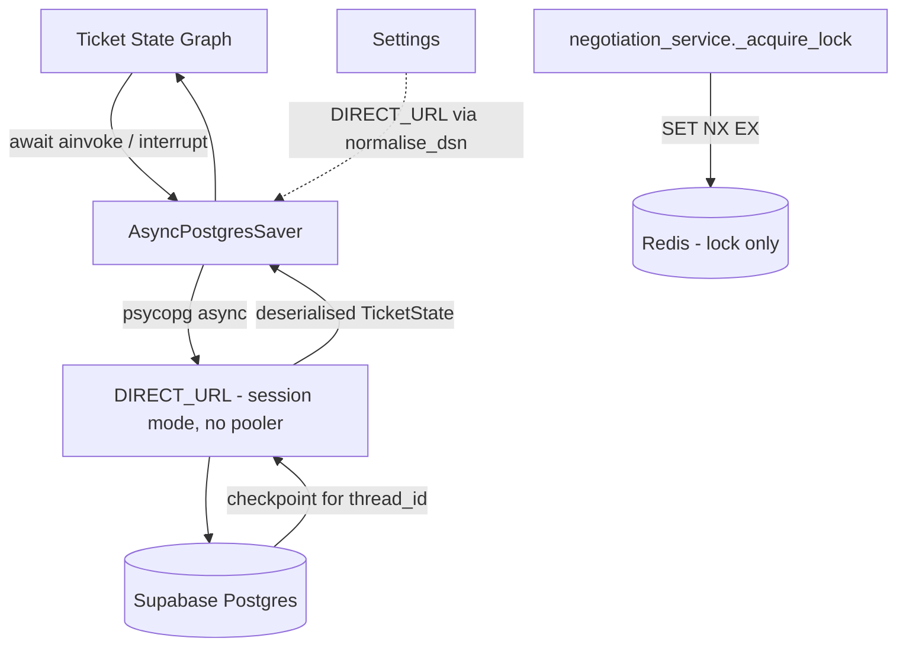

## Architecture: LangGraph Postgres checkpointer

### Why the split

Two stores, two jobs:

- **Postgres** holds the paused graph. Durable, no TTL, backed up with the rest of
  the data, and already running.
- **Redis** holds only the per-thread resume lock. Three things can resume a
  negotiation — a vendor message, a follow-up timer, a PM decision — and the saver
  has no per-thread lock of its own, so two concurrent resumes on one thread would
  corrupt the checkpoint. That is a lock, not storage: it needs no modules, tolerates
  loss (the code proceeds and falls back to the in-node `kind` assertions), and is
  the one job Upstash does well.

### Thread ids

| Thread | Graph | Written by |
|---|---|---|
| `ticket-{id}` | parent (intake → dispatch → negotiate) | ticket submission |
| `dispatch-{id}-{n}` | post-approval | `_dispatch_from_db` fallback |
| `negotiation-{job}-{ts}` | negotiation subgraph | `_negotiate_from_db` rebuild |

`_resume_negotiation` reads the prefix to pick which graph owns the thread.
