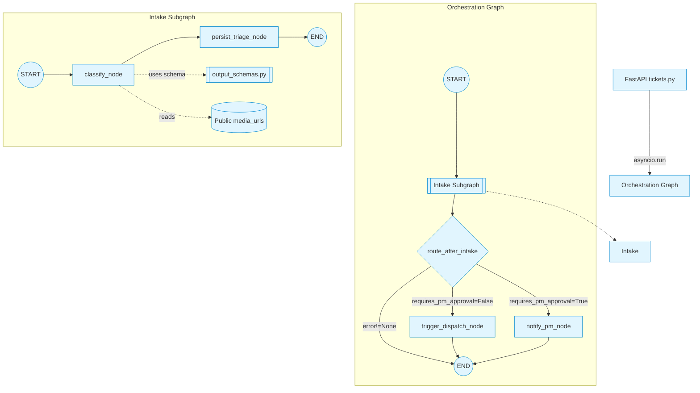

## Architecture: LangGraph Intake and Orchestration

```mermaid
graph TD
    classDef default fill:#f9f9f9,stroke:#333,stroke-width:1px;
    classDef node fill:#e1f5fe,stroke:#0288d1,stroke-width:1px;
    classDef conditional fill:#fff9c4,stroke:#fbc02d,stroke-width:1px;

    User[FastAPI tickets.py] -->|asyncio.run| Orchestrator[Orchestration Graph]

    subgraph Orchestration Graph
        START((START)) --> intake_subgraph[[Intake Subgraph]]
        intake_subgraph --> router{route_after_intake}
        
        router -->|requires_pm_approval=False| dispatch_node[trigger_dispatch_node]:::node
        router -->|requires_pm_approval=True| notify_pm[notify_pm_node]:::node
        router -->|error!=None| END_NODE((END))
        
        dispatch_node --> END_NODE
        notify_pm --> END_NODE
    end

    subgraph Intake Subgraph
        intake_start((START)) --> classify[classify_node]:::node
        classify --> persist[persist_triage_node]:::node
        persist --> intake_end((END))
        
        classify -.->|uses schema| schemas[[output_schemas.py]]
        classify -.->|reads| public_urls[(Public media_urls)]
    end
    
    intake_subgraph -.-> Intake
```
