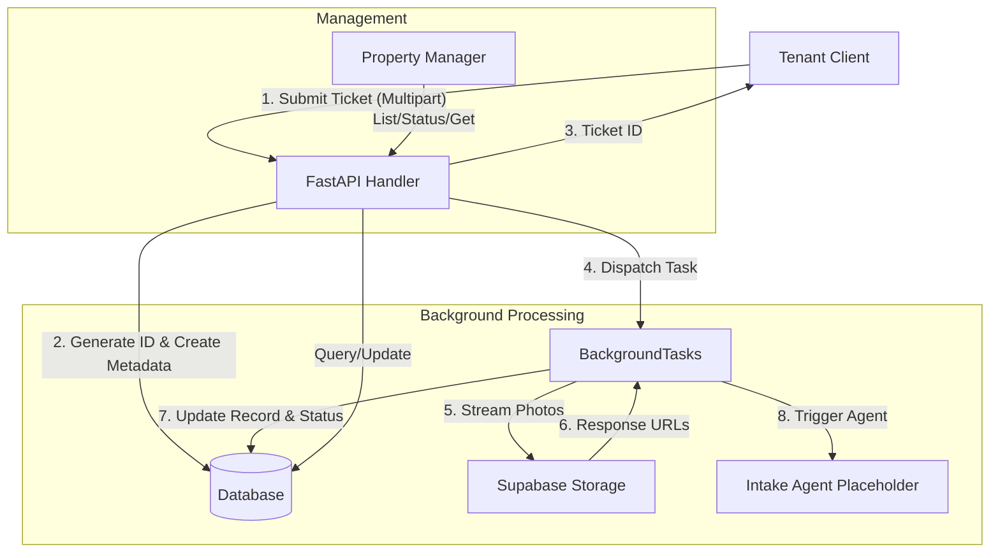

## Architecture: Tickets CRUD APIs

```mermaid
graph TD
    Tenant[Tenant Client] -- 1. Submit Ticket (Multipart) --> API[FastAPI Handler]
    API -- 2. Generate ID & Create Metadata --> DB[(Database)]
    API -- 3. Ticket ID --> Tenant
    API -- 4. Dispatch Task --> BG[BackgroundTasks]
    
    subgraph Background Processing
        BG -- 5. Stream Photos --> SS[Supabase Storage]
        SS -- 6. Response URLs --> BG
        BG -- 7. Update Record & Status --> DB
        BG -- 8. Trigger Agent --> AI[Intake Agent Placeholder]
    end
    
    subgraph Management
        PM[Property Manager] -- List/Status/Get --> API
        API -- Query/Update --> DB
    end
```
