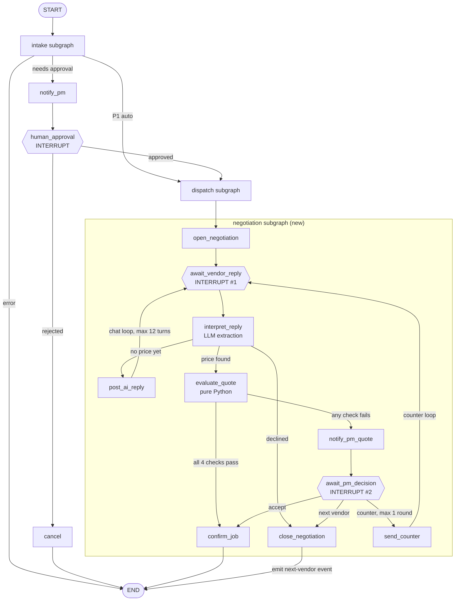
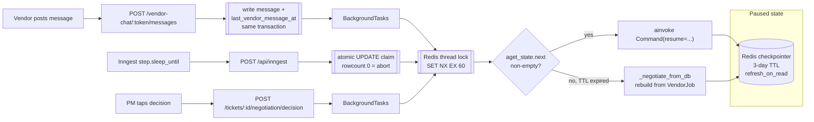
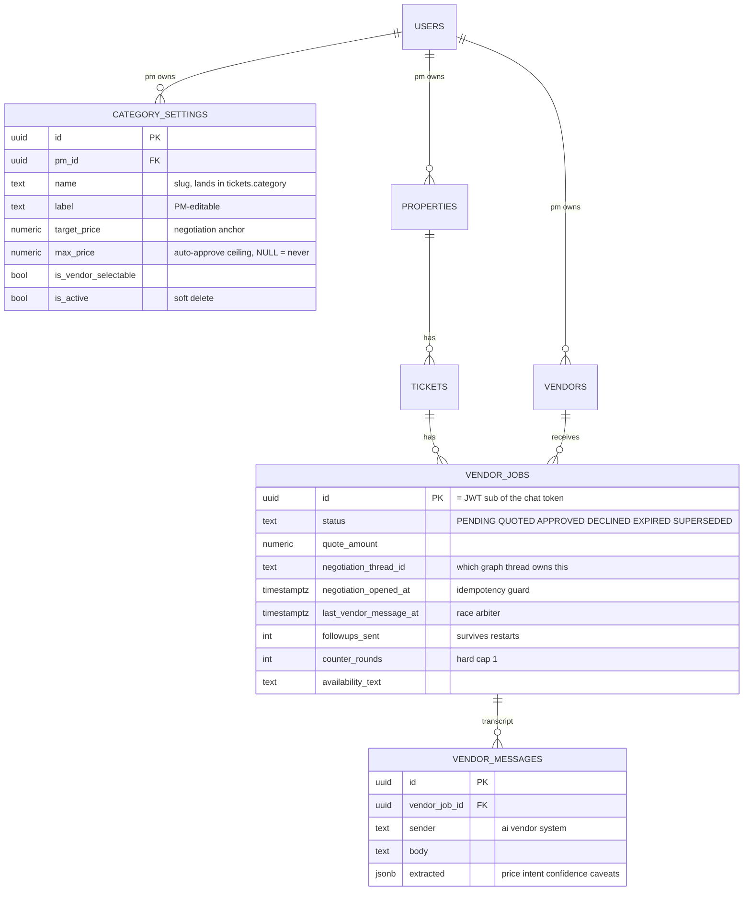
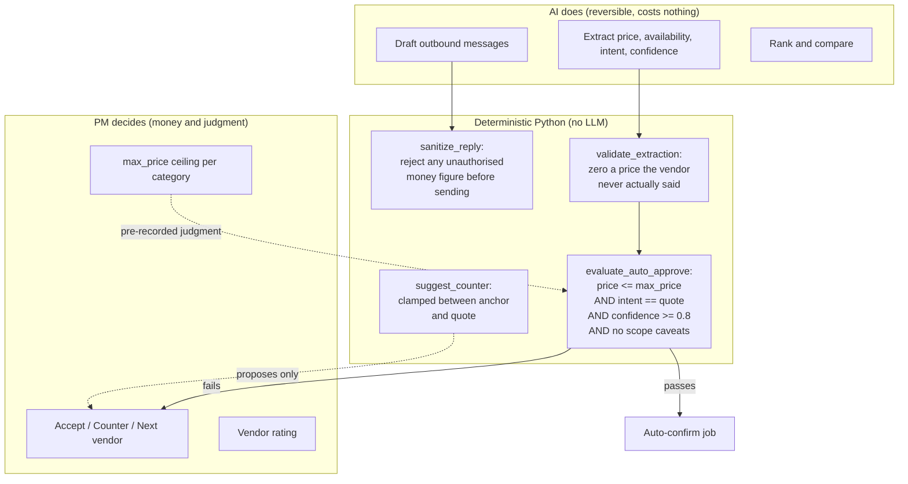
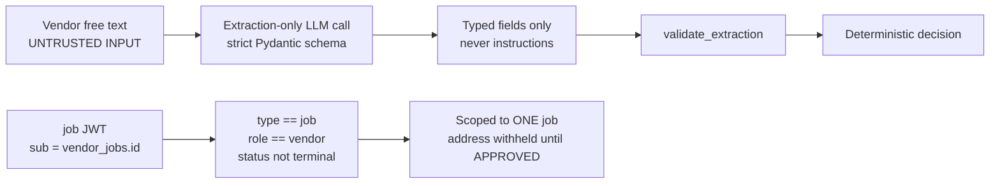

## Architecture: Vendor Negotiation Agent

### Graph topology

```mermaid
graph TD
    START([START]) --> INTAKE[intake subgraph]
    INTAKE -->|P1 auto| DISPATCH[dispatch subgraph]
    INTAKE -->|needs approval| NOTIFY[notify_pm]
    INTAKE -->|error| ENDX([END])
    NOTIFY --> HITL{{"human_approval<br/>INTERRUPT"}}
    HITL -->|approved| DISPATCH
    HITL -->|rejected| CANCEL[cancel]
    CANCEL --> ENDX

    DISPATCH --> OPEN[open_negotiation]

    subgraph NEG["negotiation subgraph (new)"]
        OPEN --> AWAIT{{"await_vendor_reply<br/>INTERRUPT #1"}}
        AWAIT --> INTERP[interpret_reply<br/>LLM extraction]
        INTERP -->|no price yet| POST[post_ai_reply]
        POST -->|chat loop, max 12 turns| AWAIT
        INTERP -->|declined| CLOSE[close_negotiation]
        INTERP -->|price found| EVAL[evaluate_quote<br/>pure Python]
        EVAL -->|all 4 checks pass| CONFIRM[confirm_job]
        EVAL -->|any check fails| NPM[notify_pm_quote]
        NPM --> APM{{"await_pm_decision<br/>INTERRUPT #2"}}
        APM -->|accept| CONFIRM
        APM -->|counter, max 1 round| COUNTER[send_counter]
        APM -->|next vendor| CLOSE
        COUNTER -->|counter loop| AWAIT
    end

    CONFIRM --> ENDX
    CLOSE -->|emit next-vendor event| ENDX
```

### Resume paths — what wakes a paused graph

```mermaid
graph LR
    subgraph PAUSED["Paused state"]
        REDIS[(Redis checkpointer<br/>3-day TTL<br/>refresh_on_read)]
    end

    VENDOR[Vendor posts message] --> CHATAPI["POST /vendor-chat/:token/messages"]
    CHATAPI --> CLAIM[["write message +<br/>last_vendor_message_at<br/>same transaction"]]
    CLAIM --> BG[BackgroundTasks]

    TIMER[Inngest step.sleep_until] --> HOOK["POST /api/inngest"]
    HOOK --> ATOMIC[["atomic UPDATE claim<br/>rowcount 0 = abort"]]

    PM[PM taps decision] --> PMAPI["POST /tickets/:id/negotiation/decision"]
    PMAPI --> BG2[BackgroundTasks]

    BG --> LOCK
    ATOMIC --> LOCK
    BG2 --> LOCK
    LOCK[["Redis thread lock<br/>SET NX EX 60"]] --> RESUME{aget_state.next<br/>non-empty?}
    RESUME -->|yes| CMD["ainvoke Command(resume=...)"]
    RESUME -->|no, TTL expired| REBUILD["_negotiate_from_db<br/>rebuild from VendorJob"]
    CMD --> REDIS
    REBUILD --> REDIS
```

### Data model

```mermaid
erDiagram
    USERS ||--o{ CATEGORY_SETTINGS : "pm owns"
    USERS ||--o{ PROPERTIES : "pm owns"
    USERS ||--o{ VENDORS : "pm owns"
    PROPERTIES ||--o{ TICKETS : has
    TICKETS ||--o{ VENDOR_JOBS : has
    VENDORS ||--o{ VENDOR_JOBS : receives
    VENDOR_JOBS ||--o{ VENDOR_MESSAGES : "transcript"

    CATEGORY_SETTINGS {
        uuid id PK
        uuid pm_id FK
        text name "slug, lands in tickets.category"
        text label "PM-editable"
        numeric target_price "negotiation anchor"
        numeric max_price "auto-approve ceiling, NULL = never"
        bool is_vendor_selectable
        bool is_active "soft delete"
    }

    VENDOR_JOBS {
        uuid id PK "= JWT sub of the chat token"
        text status "PENDING QUOTED APPROVED DECLINED EXPIRED SUPERSEDED"
        numeric quote_amount
        text negotiation_thread_id "which graph thread owns this"
        timestamptz negotiation_opened_at "idempotency guard"
        timestamptz last_vendor_message_at "race arbiter"
        int followups_sent "survives restarts"
        int counter_rounds "hard cap 1"
        text availability_text
    }

    VENDOR_MESSAGES {
        uuid id PK
        uuid vendor_job_id FK
        text sender "ai vendor system"
        text body
        jsonb extracted "price intent confidence caveats"
    }
```

### Control split — who decides what

```mermaid
graph TD
    subgraph AI["AI does (reversible, costs nothing)"]
        A1[Draft outbound messages]
        A2[Extract price, availability, intent, confidence]
        A3[Rank and compare]
    end

    subgraph CODE["Deterministic Python (no LLM)"]
        C1["evaluate_auto_approve:<br/>price <= max_price<br/>AND intent == quote<br/>AND confidence >= 0.8<br/>AND no scope caveats"]
        C2["sanitize_reply:<br/>reject any unauthorised<br/>money figure before sending"]
        C3["validate_extraction:<br/>zero a price the vendor<br/>never actually said"]
        C4["suggest_counter:<br/>clamped between anchor<br/>and quote"]
    end

    subgraph PM["PM decides (money and judgment)"]
        P1[max_price ceiling per category]
        P2[Accept / Counter / Next vendor]
        P3[Vendor rating]
    end

    A2 --> C3 --> C1
    A1 --> C2
    C1 -->|passes| AUTO[Auto-confirm job]
    C1 -->|fails| P2
    P1 -.->|pre-recorded judgment| C1
    C4 -.->|proposes only| P2
```

### Trust boundary

```mermaid
graph LR
    UNTRUSTED["Vendor free text<br/>UNTRUSTED INPUT"] --> EXTRACT["Extraction-only LLM call<br/>strict Pydantic schema"]
    EXTRACT --> TYPED["Typed fields only<br/>never instructions"]
    TYPED --> GUARD[validate_extraction]
    GUARD --> PYTHON["Deterministic decision"]

    TOKEN["job JWT<br/>sub = vendor_jobs.id"] --> GUARDS["type == job<br/>role == vendor<br/>status not terminal"]
    GUARDS --> SCOPED["Scoped to ONE job<br/>address withheld until APPROVED"]
```
